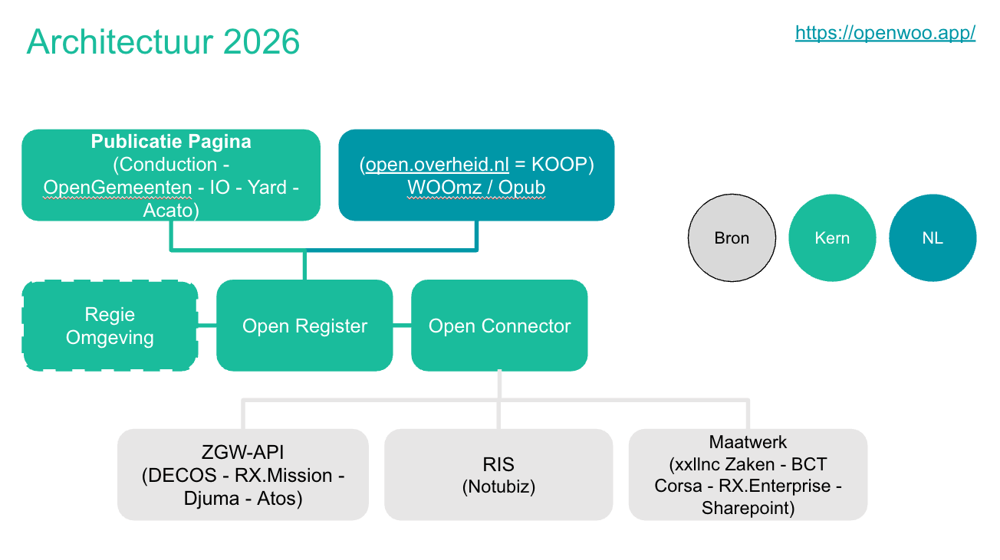

# Architectuur — overzicht

## Schematische weergave OpenWoo

## Doel van OpenWoo

OpenWoo heeft als doel om een ecosysteem van samenwerkende componenten te bieden dat voorziet in de volgende functionaliteit:

- ✅ Opslag en ontsluiting van documenten en metadata middels API's;
- ✅ Het indexeren van documenten en metadata, en het ontsluiten van zoekresultaten middels API's;
- ✅ Het werken met (concept) publicaties;
- ✅ Het uploaden, registreren en publiceren van documenten en metadata door medewerkers;
- ✅ Het (door)zoeken, vinden en raadplegen van documenten en metadata door burgers;
- ✅ Het beheren van autorisaties, configuratie en publicaties door beheerders;
- ✅ Integratie met de landelijke voorziening PLOOI/KOOP, WooGLe, Koophulpje, DSO;
- ✅ Integratie met standaard gemeentelijke bronnen zoals een zaaksysteem, raadsinformatiesysteem of website;
- ✅ Het kunnen terugtrekken van publicaties t.b.v. herstel op procedurele fouten;
- 🔄 (Roadmap) Federatieve zoekvraag.

## Hergebruik tot op het bot

OpenWoo maakt voor haar onderliggende techniek en architectuur gebruik van OpenCatalogi. Meer technische informatie over publiceren naar het federatief datastelsel vind je dan ook in de architectuurdocumentatie van OpenCatalogi. Er zijn echter een paar zaken die we binnen OpenWoo aanvullend regelen.

In plaats van de standaard OpenCatalogi-voorkant gebruikt OpenWoo een publicatiepagina die geoptimaliseerd is voor de Woo. Dit kan een (sub)site zijn bij de websiteleverancier van de gemeente, of een van de twee losstaande React-pagina's. We laten de keuze hiervoor bewust bij de deelnemende overheden zelf.

We maken gebruik van een losse WOO-(micro)service die vanuit verschillende bronnen (o.a. zaaksystemen en raadsinformatiesystemen) informatie ophaalt en klaarzet als publicatie. Of en hoe publicaties vervolgens automatisch worden gepubliceerd is een configuratiekeuze.

Er is naast de standaard beheeromgeving een RegieTool beschikbaar die specifiek gericht is op het (handmatig) verwerken van Woo-verzoeken en beheren van publicaties.

## Uitdagingen

Bij het ontwikkelen van een publicatievoorziening komen een aantal uitdagingen in beeld:

- Woo-gegevens staan vaak opgeslagen in bronnen die niet makkelijk toegankelijk zijn.
- De scope van de Woo (alle niet-vertrouwelijke gegevens) in combinatie met het concept actieve openbaarmaking raakt de volledige informatiehuishouding.
- Handmatig publiceren kan daarmee geen eindoplossing zijn, maar eigenlijk ook al geen tussenoplossing.
- Er mogen géén fouten worden gemaakt met anonimiseren; dit vraagt om een afgebakende procesflow met checks en balances rondom publiceren.

Dat leidt tot de conclusie dat we niet op zoek zijn naar een Woo-publicatieplatform maar een algemene publicatievoorziening die één of meerdere publicatiekanalen kan "voeden". Daarbij denken we naast de Woo-Index (KOOP) ook nadrukkelijk aan een organisatie-eigen publicatieplatform, WooGLe en bijvoorbeeld een gemeentelijke website. 

## Bijdragen aan de roadmap

Organisaties kunnen bijdragen aan de ontwikkeling van deze componenten door items aan te dragen, deze zelf op te pakken en uit te voeren, of door de uitvoering ervan te financieren.
